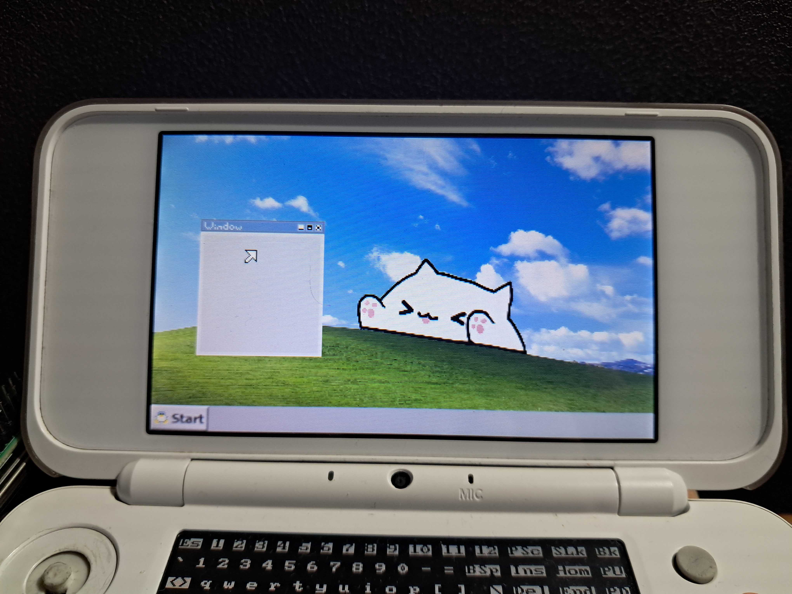
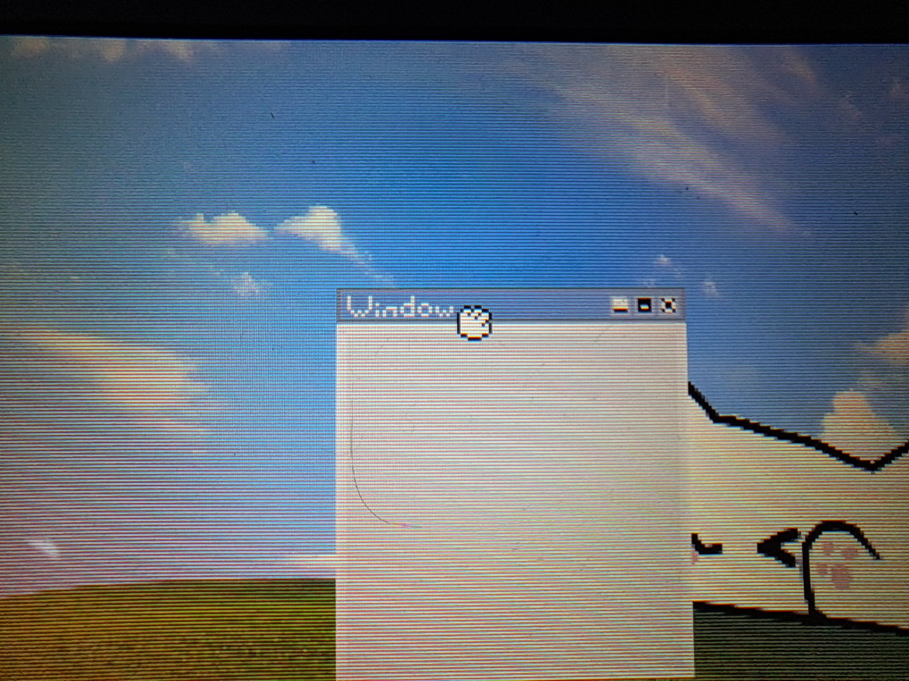

# The *3ds-fbge* project :
## (aka 3ds-FrameBufferGraphicalEnvironnement)

-------------------------------------------------
## What is it?
The *3ds-fbge* project is meant to be a standalone graphical user interface (or GUI) to be used on the port of Linux for the 3DS, it works entierely using embed C code and the raw framebuffer of the device, no X server or graphical library needed.
I mostly worked on the codebase part while [xippo](https://github.com/AtexBg/3ds-fbge?tab=readme-ov-file#credits) worked on the graphics and the ideas.
> NOTE: This is the first release of the graphical environnement, it's just the beggining of the developpement and a mess for now, it's gonna be better with later releases.
-------------------------------------------------



## What it can do?
For now basically nothing, it's more a proof-of-concept, it just displays a background image with a movable window, a taskbar, and a cursor that can be moved with the circle pad, but it's still in *active developpement*.

-------------------------------------------------

## How does it works? (technically):

### HARDWARE INTERACTION:
First the `int main():` function opens the framebuffer (device */dev/fb0* like any Linux device) for read and write operations :
```c
	int fb = open("/dev/fb0", O_RDWR);
```
Then we have the `struct fb_var_screeninfo vinfo;` that will get the buffer information and allocate a second back-buffer into memory (`*uint8_t *buffer = malloc(width * height * bpp);*`).

For the CirclePad/Mouse, it opens the special device */dev/input/mouse0*
```c
	// read data from circle pad device
    int mouse = open("/dev/input/mouse0", O_RDONLY);
```
and will fetch 3-bit packets and convert them into directions to calculate the `x` and `y` positions of the cursor.

-------------------------------------------------

### GRAPHICS:

I implemented 3 ways of drawing graphics:
----------------------------
- By using the `draw_rect(buffer,stride,bpp,X,Y,W,H,R,G,B,width,height);` function call (draws a simple rectangle with a flat color)
- By using the `memcpy(buffer, background, BG_W * BG_H * 3);` function call (draws an arrayed image, only works with 400x240 images (background))
- By using the `drawSprite(buffer,stride,bpp, X, Y, width, height, *_W, *_H, INDEX);` function call (draws any sprite from *graphics.h* at given coordinates)
-----------------------------
They're all stored in *[graphics.h](https://github.com/AtexBg/3ds-fbge/blob/main/headers/graphics.h)* as arrays of color to be used on the color palette, normal PNGs/JPEGs are converted to thoses arrays using [img2array.py](https://github.com/AtexBg/3ds-fbge/blob/main/dev/img2array.py)

-----------------------------

## USAGE:
Download the [binary file](https://github.com/AtexBg/3ds-fbge/releases/download/v0.2.0/wm-v4) and run in within Linux3DS, for that you will first need to install the OS from the [linux_3ds-fbge_install.zip](https://github.com/AtexBg/3ds-fbge/releases/download/v0.1.0/linux_3ds-fbge_install.zip) from the release tab and extract it to your SD card's root, otherwise you can use [this new release](https://gbatemp.net/threads/release-linux-for-the-3ds.407187/page-35#post-8522677).
The CirclePad acts as a mouse and the L trigger as the main mouse click, may change later.

### COMPILING:
To compile this you need : 
- A computer running Linux (or WSL on Windows)
- the packages `build-essential` and `arm-linux-gnueabi-gcc` installed

Then just execute the `./compile.sh` script and it will compile the binary in "*./build/wm-v4*", but you can change the name of the file/dir with the parameters inside *compile.sh*.

-----------------------------

## FILE STRUCTURE:

```shell
-3ds-fbge/             # Main Directory
 |-dev/                # Contains the PNGs textures and dev scripts (unused in binary)
 |  |-img2array.py     # Script to convert images into data arrays
 |  |-BackupMainC.bat  # Script to backup main.c file while coding
 |  |-gfx/             # Dir containing the PNG images
 |    |-cursor.png        
 |    |-taskbar.png
 |    |-window1.png
 |    |-ect...
 |-build/              # Output dir for binary, see $(OUTPUT_DIR) on *compile.sh*
 |  |-wm-v4            # Output file, ready to execute, see $(OUTPUT) on *compile.sh*
 |-headers/            # Dir containing file headers
 |  |-graphics.h        # Contain all graphics arrays
 |  |-screenshot.h      # Data header for the screenshot function (not imp yet)
 |-main.c               # Main code file, contain logic
 |-compile.sh          # Script to compile the DE       
 |-README.md           # This file. Simpely.
```


## Why?
why not?

## TODO:
- Make screenshots function work (and make a converter on PC)
- add item selection and detection 
- fill imported headers
- Upgrade input handler for every button
- Add more graphical content
- Add proper keyboard handler
- Add option to go back to Linux shell
- Implement start menu
- Fix innacurates coordinates while moving windows


## FIXED SINCE LAST RELEASE:
- OOM Errors by buffer overflow
- Rotated coordinates
- Added screenshots in Github repo
- Made the code cleaner
- Added more graphics
- Added windows moving
- Added mouse click detection
- And other things i don't remember...

## Credits
--------------------------
### AtexBg
 - [**Github**](https://github.com/AtexBg)
 - [**Reddit**](https://reddit.com/u/AtexBg)
 - [**YouTube**](https://youtube.com/@AtexBg)
 - [**Discord**](https://discord.gg/YfrV2hGg) : atexbg
>----------------------------------------------
### xippo
 - [**Github**](https://github.com/xippopo)
 - [**Reddit**](https://reddit.com/u/Willing-Stomach3649)
 - **Discord** : xippo1621
>-----------------------------------------------
Also feel free to contact us if you want to collabore for the project :3
