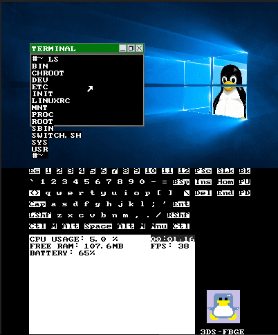
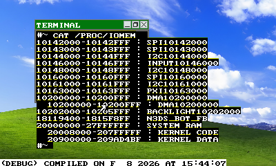
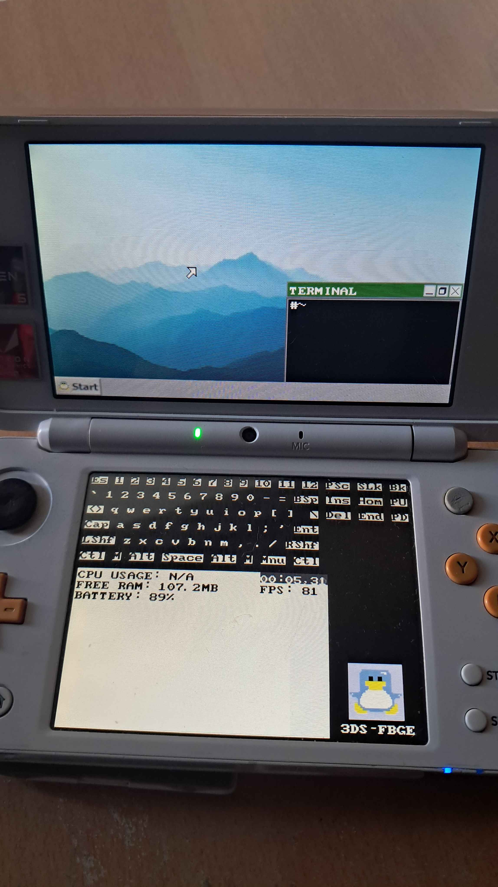
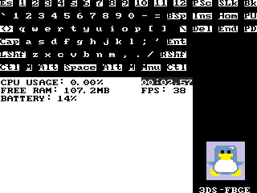

# -- The *3ds-fbge* project : --
## (aka 3ds-FrameBufferGraphicalEnvironnement)

-------------------------------------------------
## What is it?
### The *3ds-fbge* project is meant to be a standalone graphical user interface (or GUI) to be used on the port of Linux for the 3DS as some kind of desktop environnemennt, it works entierely using native C code, the Linux API, and the raw framebuffer(s) of the device, no X server or conventional graphical library needed.

-------------------------------------------------
## Features:
Not a lot of things, and it's still very glitchy, but we have a working terminal and a good part of the communication to the hardware was implemented and is usable (without having to patch/recompile the kernel, which i tried but doesn't work well), tho there's still a lot of work to do to make this program "usable and useful"

## Shortcuts:
I added a few shortcuts that we can use while the DE is running, here's a few of them : 

- R + START: Open settings
- START + X: Take screenshot (saved as .bmp, disabled for this version because it's broken)
- START + A : Quit 3DS-FBGE
- A+B+L+R: Syns the filesystem and poweroff the console

-------------------------------------------------

## USAGE:
### IMPORTANT: You will need to have Linux installed on your console first, for this use the [provided install package](https://github.com/AtexBg/3ds-fbge/releases/download/v0.1.0/linux_3ds-fbge_install.zip) and extract it to your 3ds SD card root (linux works on every 3ds model).

Very simple, just download the [binary file](https://github.com/AtexBg/3ds-fbge/releases/download/v0.6.0/fbge) and put in in your SD card, then boot **linux_bootloader.firm** and type `/switch.sh` (it's a little script included in the Linux package to mount SD card and populate /dev/), and then launch the binary (/mnt/ is your sd card, you can use `./mnt/fbge` for example).

## SD CARD:
Card should be at least 2GB and formatted in FAT32, any cluster size is fine but 32Ko works the best.
/!\\ Also you should use an SD card with nothing important on it because the kernel SD/MMC driver is unstable and can corrupt the filesystem, also cards which are 32GB or more will crash the kernel I/O handler

#### Binary tested on New3DS only, but should work on Old models too (??)
-----------------------------------
### COMPILING:
To compile this code, you need : 
- A computer running Linux (or WSL on Windows)
- the packages `build-essential`, `make` and `gcc-arm-linux-gnueabi` (ARM cross-compiler) installed

Then just execute the `make` command and it will compile the binary in "*./build/fbge*", but you can change the name of the file/dir with the parameters inside the *Makefile*.

-----------------------------

## Why?
why not? it's just a fun project :3
Btw a little fun fact : the bottom screen doesn't have a framebuffer, so it instead uses raw `/dev/mem` at memory address **0x18119400** lol

# Pictures:
 (PS : Pictures have been taken with raw framebuffer dumps which have been converted, the screenshot func in the code is still broken)

![Top screen with terminal][pictures/top_with_terminal.bmp]

## TODO:
- Test the code on Old3DS
- Implement some apps
- Fix terminal text buffer overflowing
- Make better use the devices provided by the kernel (LEDs, battery, etc..)
- Fix glitches in text and window rendering
- Make a clean and working window manager
- Reverse-enginner the internal SPI controller to be able to use the **touch** screen
- Optimize performances more and reduce I/O bottleneck
- Make a proper application framework and API

## ADDED SINCE LAST RELEASE:
- Optimized the Makefile and added **ANSI colors** to it
- Fixed *smalls terminal glitches*
- Removed unused **frameskip**
- Refactored the text render code
- Hardcoded size/bpp/stride for rendering in a better way
- Renamed "*setLED_asRGB*" function to "*SetLED*" as well as some others funcs for more clarity
- Partially fixed width and height of the screen being reversed sometimes
- Added screenshots output in BMP format instead of raw BIN
- Added full bottom screen framebuffer mapping
- Renamed draw.c/h to TOP_render.c/h for more clarity
- Added function to use SysRQ from the code
- Changed the font for a cleaner one
- Temporary use the 3DS's LED as FPS monitor
- Optimized top framebuffer rendering

## ALREADY FIXED/ADDED:
- Some OOM Errors by buffer overflow
- Rotated coordinates
- Added screenshots in Github repo
- Made the code cleaner
- Added more image assets
- Added windows moving
- Added mouse click detection
- Upgrade input handler for every button
- Add more graphical content
- Add proper keyboard handler
- Add option to go back to Linux shell
- Fix innacurate coordinates while moving window
- Make screenshots function work (and make a converter on PC)

## WILL NEVER BE ADDED:
- Sound (the custom kernel DOESN'T support sound)
- Network/Wi-Fi (no network driver is implemented into the kernel)
- Ports on other devices (the code is specifically made for the 3DS framebuffer and linux kernel and would need a big rewrite to port elsewhere, altough i managed to run it on an RPi with a few tweaks)

*Feel free to report issues if anything goes wrong while testing ^^*

[def]: top_with_terminal.bmp