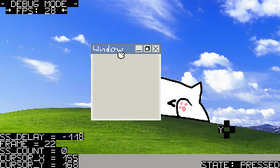

# --- The *3ds-fbge* project : ---
## (aka 3ds-FrameBufferGraphicalEnvironnement)

-------------------------------------------------
## What is it?

### The *3ds-fbge* project is meant to be a standalone graphical user interface (or GUI) to be used on the port of Linux for the 3DS, it works entierely using embed C code and the raw framebuffer of the device, no X server or graphical library needed.
### I (AtexBg) mostly worked on the codebase part while [xippo](https://github.com/AtexBg/3ds-fbge?tab=readme-ov-file#credits) worked on the graphics and the ideas.

-------------------------------------------------
## Features:
Kinda nothing for now, i only implemented a *working terminal*, a window we can move with the mouse (circle pad, mapped as **/dev/input/mouse0** by the kernel), some settings we can change, and the following *shortcuts* : 

- R + START: Open settings
- X: Take screenshot (saved as .bin and converted with [screenshots_converter.py](https://github.com/AtexBg/3ds-fbge/blob/main/dev/screenshots_converter.py))
- Y: Open/Close terminal window

-------------------------------------------------

## USAGE:
### IMPORTANT: You will need to have Linux installed on your console first, for this use the [provided install package](https://github.com/AtexBg/3ds-fbge/releases/download/v0.1.0/linux_3ds-fbge_install.zip) and extract it to your 3ds SD card root (linux works on every 3ds model).

Very simple, just download the [binary file](https://github.com/AtexBg/3ds-fbge/releases/download/v0.5.0/fbge) and put in in your SD card, then boot **linux_bootloader.firm** and type `/switch.sh` (little script included in the Linux package to mount SD card and populate /dev/), and then launch the binary (/mnt/ is your sd card, use `./mnt/fbge` for example).

(/!\\ you should use another SD card with nothing important on it because the kernel is unstable and can corrupt the FS, also cards which are 32GB or more will crash the kernel I/O handler)

#### Binary tested on New3DS only, but should work on Old models too (??)
-----------------------------------
### COMPILING:
To compile this code, you need : 
- A computer running Linux (or WSL on Windows)
- the packages `build-essential`, `make` and `arm-linux-gnueabi-gcc` (ARM cross-compiler) installed

Then just execute the `make` command and it will compile the binary in "*./build/fbge*", but you can change the name of the file/dir with the parameters inside the *Makefile*.

-----------------------------

## Why?
why not? it's just a fun project :3

## TODO:
- Add more feautres
- Fix some bugs
- Test the code on Old3DS
- Implement some apps
- Make the code more readable
- Fix terminal text buffer overflowing
- Prevent segfaults by adding overlapping checks
- Use the devices provided by the kernel (LEDs, battery, etc..)

## ALREADY FIXED:
- Some OOM Errors by buffer overflow
- Rotated coordinates
- Added screenshots in Github repo
- Made the code cleaner
- Added more graphics
- Added windows moving
- Added mouse click detection
- Upgrade input handler for every button
- Add more graphical content
- Add proper keyboard handler
- Add option to go back to Linux shell
- Fix innacurate coordinates while moving window
- Make screenshots function work (and make a converter on PC)

## WILL NEVER BE ADDED:
- Sound (the custom kernel DOESN'T support any kind of sound)
- Ports on other devices (the code is specifically made for the 3DS framebuffer and linux kernel and would need a big rewrite to port elsewhere)

## Credits
### AtexBg
 - [**Github**](https://github.com/AtexBg)
 - ~~[**Reddit**](https://reddit.com/u/AtexBg)~~ 
 - [**YouTube**](https://youtube.com/@AtexBg)
 - **Discord**: atexbg
>----------------------------------------------
### xippo
 - [**Github**](https://github.com/xippopo)
 - [**Reddit**](https://reddit.com/u/Willing-Stomach3649)
 - **Discord**: xippo1621
>----------------------------------------------
*Feel free to report issues if anything goes wrong while testing ^^*
